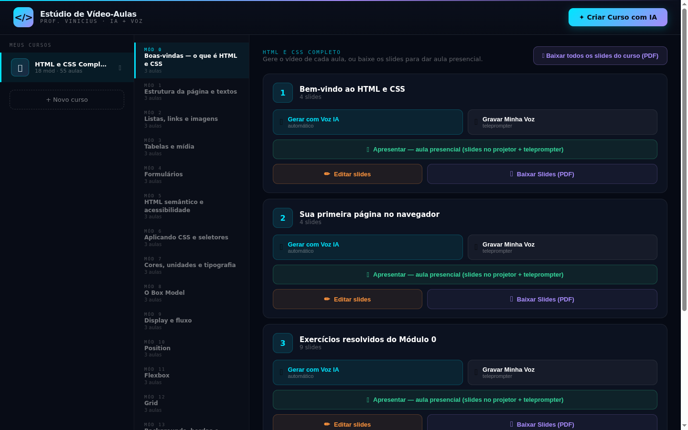
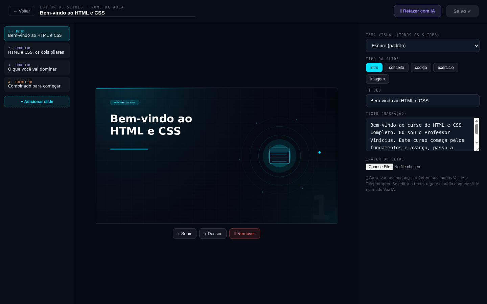

  

  # GCIA — Gerador de Cursos com IA

  **Crie vídeo-aulas completas com Inteligência Artificial.**
  Descreva o tema → a IA monta módulos, aulas, slides e narração → você gera o vídeo, com a **sua voz** (ou voz de IA) e a **sua câmera**.

  
  

    
  

---

## 💳 Como comprar / ativar

O GCIA é vendido por **licença**. Para adquirir a sua, fale comigo:

### 📱 WhatsApp: **[(24) 99941-7827](https://wa.me/5524999417827)**

**Passo a passo:**
1. Chame no WhatsApp e consulte **valores e formas de pagamento**.
2. Após o pagamento, eu crio sua **licença** e te envio **e-mail e senha** de acesso.
3. Baixe o programa, instale e entre com seu e-mail e senha. Pronto! 🎉

> 💡 O mesmo programa serve para todos — o que libera o acesso é a sua licença.

## ✨ O que o GCIA faz

- 🤖 **Cria cursos com IA** — descreva o tema de **qualquer área** (Excel, Matemática, Inglês, Marketing, Biologia, Violão...) e a IA monta o curso inteiro.
- 🧠 **Escolha a sua IA** — use **OpenAI** (GPT-4o) ou **Claude** (Sonnet 4.6 / Opus 4.8 / Haiku 4.5) e **troque de modelo em tempo real**.
- 🎙️ **Narração do seu jeito** — voz de **IA** ou **grave a sua voz** no teleprompter embutido.
- 🎥 **Você no vídeo** — câmera num círculo ajustável, com **fundo virtual estilo Zoom** (desfoque, cor ou imagem).
- ✏️ **Editor de slides** — edite textos, tópicos e imagens; refaça uma aula com IA.
- 🖥️ **Aula presencial** — slides no **projetor** + teleprompter no notebook.
- 📘 **Apostila em PDF** — gere a apostila do curso com a IA: **capa com o seu logo**, **cor da escola**, conteúdo passo a passo com exemplos, exercícios e **referências bibliográficas**. Edite o texto **na própria página** (clique e digite, com reflow automático), arraste objetos e exporte o **PDF** com vários **temas** prontos.
- 📄 **PDF dos slides** · 🔄 **Atualização automática**.

## 🖼️ Telas do sistema

<b>Criar curso — escolha a IA (OpenAI ou Claude) e troque quando quiser</b> 
  
  

<b>Editor de slides</b> 

## ⬇️ Como baixar e instalar

1. Clique em **[⬇️ Baixar](https://github.com/valmeidavr/gcia-releases/releases/latest)** e baixe o **`GCIA ... Setup.exe`**.
2. Dê **duplo clique** no instalador.
   > O Windows pode mostrar *"O Windows protegeu o computador"*. Clique em **Mais informações → Executar assim mesmo** — normal em programas novos.
3. Abra o **GCIA** pelo atalho da Área de Trabalho ou Menu Iniciar e entre com sua licença.

## ❓ Dúvidas

Chame no WhatsApp **[(24) 99941-7827](https://wa.me/5524999417827)** — ajudo na compra, instalação e ativação.

---

© 2026 Vinícius Almeida — Todos os direitos reservados.

