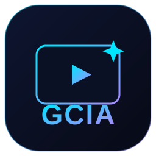

  

  # GCIA — Gerador de Cursos com IA

  **Crie vídeo-aulas completas com Inteligência Artificial.**

  Descreva o tema → a IA monta módulos, aulas, slides e narração → você gera o vídeo, com a **sua voz** (ou voz de IA) e a **sua câmera**.

  
  

---

## ✨ O que o GCIA faz

- 🤖 **Cria cursos com IA** — você descreve o tema de **qualquer área** (Excel, Matemática, Inglês, Marketing, Biologia, Violão...) e a IA monta o curso inteiro: módulos, aulas, slides e narração.
- 🎙️ **Narração do seu jeito** — gere com **voz de IA** ou **grave a sua própria voz** no teleprompter embutido.
- 🎥 **Você no vídeo** — sua câmera num círculo ajustável (posição e tamanho), com **fundo virtual estilo Zoom** (desfoque, cor ou imagem) — não precisa de cenário.
- 🖼️ **Slides bonitos** — gerados automaticamente, com exercícios resolvidos.
- 📄 **PDF dos slides** — para dar aula presencial.
- 💻 **Programa instalável (Windows)** — banco local, atualização automática.

## ⬇️ Como baixar e instalar

1. Clique em **[⬇️ BAIXAR AGORA](https://github.com/valmeidavr/gcia-releases/releases/latest)** e baixe o arquivo **`GCIA ... Setup.exe`**.
2. Dê **duplo clique** no instalador.
   > 💡 O Windows pode mostrar um aviso azul *"O Windows protegeu o computador"*. Clique em **Mais informações → Executar assim mesmo** — é normal em programas novos.
3. Conclua a instalação e abra o **GCIA** pelo atalho na **Área de Trabalho** ou **Menu Iniciar**.
4. ✅ **Atualizações são automáticas** — quando sair uma versão nova, o programa baixa e atualiza sozinho.

## 🔑 Como ativar sua licença

O acesso é por **licença** (e-mail + senha). Para obter a sua, fale comigo:

### 📱 WhatsApp: **[(24) 99941-7827](https://wa.me/5524999417827)**

Eu crio sua licença e te envio o **e-mail e senha**. Na primeira vez que abrir o programa, entre com eles. Em seguida o GCIA pede suas chaves de **OpenAI** (para a IA) e **ElevenLabs** (para a voz) — eu te oriento nessa parte também.

## 📸 Telas do programa

<!-- PRINTS: arraste suas imagens aqui no editor do GitHub ou suba na pasta prints/ -->
_Em breve._

## ❓ Dúvidas

Chame no WhatsApp **[(24) 99941-7827](https://wa.me/5524999417827)** — ajudo na instalação e na ativação.

---

© 2026 Vinícius Almeida — Todos os direitos reservados.

